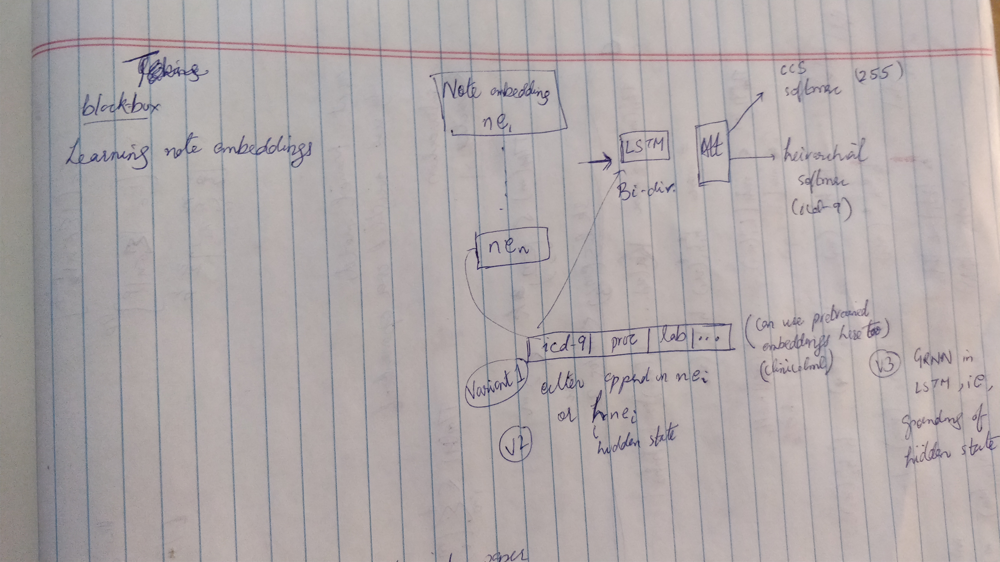

# Medical-Diagnosis-Learning

## Frequency Distribution of number of encounters per patient
(Unique combination of (pat_id, hadm_id) from diagnosis table)

1-2: 1057 
2-5: 9584 
5-10: 23368 
10-20: 19214 
20-30: 4596 
30-50: 736 

**Data Prepartion Technique** according to amiajnl-2013-002159.pdf (used by the GRNN paper as well). + Windowing (also used in Dubois et.al.)

Questions to ask: What should be the objective function in training word embeddings of each note, such that, on their aggregation* to build note embeddings conditioned on structural data, that specific information is preserved distinctly that would be helpful in predicting the diagnoses.
 
  *Aggregation would involve min, mean, max of embeddings (Dubois et. al.)

Preliminary Model:
